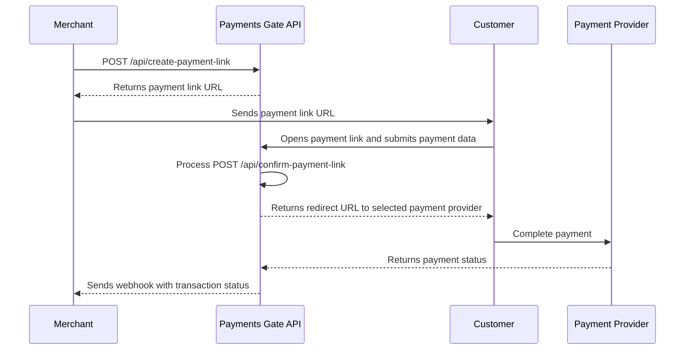

## 📝 Overview

Payments Gate is a robust and secure payment gateway solution designed to facilitate seamless online transactions. It provides APIs  for integrating payment processing into your applications or websites.


## 📑 Table of Contents

- [📝 Overview](#-overview)
- [📑 Table of Contents](#-table-of-contents)
- [✨ Features](#-features)
- [🛠️ Technology Stack](#-technology-stack)
- [📚 API Documentation](#-api-documentation)
- [🚀 Live Demo](#-live-demo)
- [🔌 Payment Processor Integration](#-payment-processor-integration)
- [🧩 Architecture Overview](#-architecture-overview)
  - [⚙️ Payment Processing](#️-payment-processing)
  - [🔄 Refund Processing](#-refund-processing)
  - [🗺️ Payment Status Map](#️-payment-status-map)
- [💳 Integrated Payment Providers](#-integrated-payment-providers)
  - [🔹 TPay](#-tpay)
  - [🔹 Paynow](#-paynow)
  - [🔹 Noda](#-noda)
- [🔗 Payment Links](#-payment-links)
  - [⚙️ How It Works](#️-how-it-works)
  - [🧱 API Endpoints](#-api-endpoints)
  - [📦 Example Request](#-example-request)
  - [📬 Example Response](#-example-response)
  - [🔒 Security Notes](#-security-notes)
  - [🧭 Payment Link Flow](#-payment-link-flow)
- [🔐 Authentication – API Key & Secret Key](#authentication--api-key--secret-key)
  - [🔐 How Authentication Works](#-how-authentication-works)
  - [🔧 Getting Your Keys](#-getting-your-keys)
  - [📡 Making Authenticated Requests](#-making-authenticated-requests)
  - [🔁 Retry Policy](#-retry-policy)
- [🔔 Webhook Mechanism](#-webhook-mechanism)
  - [📌 When are webhooks triggered?](#-when-are-webhooks-triggered)
  - [🧾 Webhook Payload](#-webhook-payload)
    - [Example JSON payload](#example-json-payload)
- [🔐 Webhook Signature Verification](#-webhook-signature-verification)
  - [✅ How the Signature Is Generated](#-how-the-signature-is-generated)
- [🏁 Getting Started](#-getting-started)


## ✨ Features

- Payment Links – Generate shareable payment URLs for your customers
- Secure payment processing
- RESTful API for easy integration
- Transaction history and reporting
- Webhook support for real-time notifications
- Detailed logging and error handling
- Modular integration of payment processors via dedicated service classes

## 🛠️ Technology Stack

- **Language:** PHP 8.2
- **Framework:** Laravel 12
- **Authentication:** Laravel Breeze
- **Authorization:** Laravel Permission
- **Admin and User Panel:** Filament
- **Database:** PostgreSQL / MySQL
- **API:** RESTful, JSON-based


## 📚 API Documentation

Comprehensive API documentation is available online. Visit the following link to explore available endpoints, request/response formats, and integration guides:

👉 [API Documentation](https://payments-gate.onrender.com/api/documentation)


## 🚀 Live Demo

👉 [Click here to view the live application](https://payments-gate.onrender.com)


## 🔌 Payment Processor Integration

Payments Gate supports seamless integration with multiple payment processors: **TPay**, **Paynow**, and **Noda**. Each processor is implemented as a dedicated service that adheres to a shared `PaymentMethodInterface`, enabling unified handling of transaction logic (create, confirm, refund) across providers.

``` php
interface PaymentMethodInterface
{
    public function create(array $transactionBody): ?CreateTransactionDto;
    public function confirm(array $webHookBody, array $headers): ?ConfirmTransactionDto;
    public function refund(array $refundBody): ?RefundPaymentDto;
    public function isSupportCurrency(string $currency): bool;
}
```

## 🧩 Architecture Overview

The integration uses the **Factory Pattern** to dynamically resolve the appropriate payment provider service based on the selected payment method:

```php
public static function getInstanceByPaymentMethod(?PaymentMethod $paymentMethod): PaymentMethodInterface
{
    return match ($paymentMethod) {
        PaymentMethod::PAYMENT_METHOD_TPAY => App::make(TPayService::class),
        PaymentMethod::PAYMENT_METHOD_PAYNOW => App::make(PaynowService::class),
        PaymentMethod::PAYMENT_METHOD_NODA => App::make(NodaService::class),
        default => throw new NotImplementedException("Payment method " . ($paymentMethod) . " is not implemented.")
    };
}
```
### ⚙️ Payment Processing


### 🔄 Refund Processing


### 🗺️ Payment Status Map


| Status           | Description                                           | Possible Transitions           |
|------------------|-------------------------------------------------------|--------------------------------|
| ⏳ PENDING        | Payment has been initiated and is awaiting completion | SUCCESS, FAIL                  |
| ✅ SUCCESS        | Payment was completed successfully                    | REFUND_PENDING                 |
| ❌ FAIL           | Payment failed due to an error or user cancellation   | -                              |
| ⏳ REFUND_PENDING | Refund process has been initiated                     | REFUND_SUCCESS, REFUND_FAIL    |
| ✅ REFUND_SUCCESS | Refund was processed successfully                     | -                              |
| ❌ REFUND_FAIL    | Refund attempt failed                                  | REFUND_PENDING (retry)         |


## 💳 Integrated Payment Providers

Payments Gate integrates with three major payment providers. Below is a brief overview and links to their official documentation for deeper integration details.

### 🔹 TPay

TPay is one of the most established payment service providers in Poland, supporting dozens of banks, card payments, and online transfers.

- 🔗 API Docs: [https://openapi.sandbox.tpay.com/](https://openapi.sandbox.tpay.com/)
---

### 🔹 Paynow

Paynow is a Polish online payment system that supports fast payments via bank transfers, BLIK, and cards. It is widely used in e-commerce and provides a clean REST API.

- 🔗 API Docs: [https://docs.paynow.pl/pl/docs/v3/integration](https://docs.paynow.pl/pl/docs/v3/integration)
---

### 🔹 Noda

Noda is a modern Open Banking payment gateway that enables direct bank payments via PSD2 APIs across Europe.

- 🔗 API Docs: [https://docs.noda.live/reference/introduction](https://docs.noda.live/reference/introduction)
---

Each of these operators has been integrated into **Payments Gate** to provide users with diverse and convenient payment options.

## 🔗 Payment Links

The **Payment Links** feature allows merchants to generate secure, one-time URLs that customers can use to complete payments without direct API integration. It’s ideal for quick payments.

### ⚙️ How It Works

1. The merchant creates a payment link via the API or through the admin panel.
2. A unique, signed URL is generated for example:
   https://payments-gate.onrender.com/payment/123e4567-e89b-12d3-a456-426614174000
4. The customer opens the link and completes payment using one of the integrated providers (**TPay**, **Paynow**, or **Noda**).
5. Once the payment is completed, the system updates the transaction status and sends a webhook notification to the merchant’s application.

### 🧱 API Endpoints

| Method | Endpoint | Description |
|--------|-----------|-------------|
| `POST` | `/api/create-payment-link` | Create a new payment link |
| `POST` | `/api/confirm-payment-link` | Create transaction for generated payment link |
| `GET` | `/api/payment/{payment_link_id}` | Retrieve details about a specific payment link |

### 📦 Example Request

```http
POST /api/create-payment-link
Host: https://payments-gate.onrender.com
x-api-key: your-api-key
Content-Type: application/json

{
    "amount": 249.99,
    "currency": "PLN",
    "expiresAt": "2025-10-31 00:00:00",
    "notificationUrl": "https://payments-gate.onrender.com/notification-url/",
    "returnUrl": "https://payments-gate.onrender.com/webhooks/return-url",
}
```

### 📬 Example Response

```json
{
    "paymentLink": "https://payments-gate.onrender.com/payments/123e4567-e89b-12d3-a456-426614174000",
}
```

### 🔒 Security Notes

- Each payment link is  tied to the merchant’s **API Key**.
- Protection against making multiple payments from one link.
- Links automatically **expire** after a configurable time window.  
- **Expired** links reject all payment attempts.
- Webhooks for link-based payments follow the **same flow** as standard transactions.

### 🧭 Payment Link Flow




## Authentication – API Key & Secret Key

To access and use the **Payments Gate API**, clients must authenticate using an API Key and Secret Key, which are generated by the system during account registration.

### 🔐 How Authentication Works

- Upon registration, each client receives:
  - **API Key** – public identifier used to make requests
  - **Secret Key** – private credential used to sign requests

- These credentials are required for every request to protected endpoints.


### 🔧 Getting Your Keys

1. Register or log into your account on the Payments Gate dashboard.
2. Navigate to **Profiles -> Access Keys**.
3. View your:
   - `API_KEY`
   - `SECRET_KEY`

You should store these securely and never expose your Secret Key publicly.

### 📡 Making Authenticated Requests

| Header        | Required For           | Description                                     |
|---------------|------------------------|-------------------------------------------------|
| `x-api-key`   | All API requests       | API key identifying the client           |
| `signature`   | Refund endpoints only  | HMAC-SHA256 signature verifying request origin  |

### 📦 Example Request

```http
POST /api/refund-payment
Host: https://payments-gate.onrender.com
x-api-key: your-api-key
signature: generated-signature
Content-Type: application/json

{
  "transaction_uuid": "abcd-1234",
}
```

### 🔁 Retry Policy

If a webhook fails to deliver (i.e., the HTTP response code is not `200`), the system will retry sending it **every 1 minute**, for up to **10 attempts**.

After **10 unsuccessful attempts**, the webhook will **no longer be retried**.

## 🔔 Webhook Mechanism

Our system supports webhook notifications that allow clients to automatically receive updates about the status of their transactions.

### 📌 When are webhooks triggered?

A webhook is automatically sent in the following scenarios:

- ✅ When a transaction status changes (e.g., `SUCCESS`, `FAIL`, `REFUND_SUCCESS`, etc.).
- 🔄 For refund transactions (`REFUND_PENDING`, `REFUND_SUCCESS`, `REFUND_FAIL`):

  > 💡 **Note:** Paynow processes refunds in daily batches at the end of the day.  
  > Therefore, a scheduler is responsible for periodically checking whether the status of a refund has changed by polling the payment provider.

- 🚨 If a previous webhook delivery attempt failed, retries will be attempted every minute, up to **10 times**.


### 🧾 Webhook Payload

The webhook is sent as a `POST` request to the `notification_url` associated with the transaction.

#### Example JSON payload

```json
{
  "signature": "fa7c8e27b6f3...",
  "transaction_uuid": "abcd-1234-efgh-5678",
  "amount": 199.99,
  "name": "John Doe",
  "email": "john@example.com",
  "currency": "PLN",
  "status": "SUCCESS",
  "payment_method": "TPAY"
}
```

## 🔐 Webhook Signature Verification

Payments Gate sends webhook notifications to your backend when the transaction status changes. To ensure authenticity, each request includes a `signature` field – an HMAC-SHA256 hash created using your **Secret Key**.

### ✅ How the Signature Is Generated

The signature is calculated on the server side as follows:

```php
$transaction_uuid = 'abc-123-xyz';
$payment_method = 'TPAY';
$merchantSecretKey = 'your-merchant-secret-key';

$signature = hash_hmac('sha256', $transaction_uuid . $payment_method, $merchantSecretKey);
```

 > 💡 **Note:** The same method is used to generate the signature for refund-related requests, ensuring consistency and integrity across all signed transactions.

## 🏁 Getting Started

1. **Clone the repository:**
  ```bash
  git clone https://github.com/lukaszwinicki/payments-gate
  cd payments-gate
  ```

2. **Install dependencies:**
  ```bash
  composer install
  npm install
  ```

3. **Set up environment:**
  - Copy `.env.example` to `.env` and configure your environment variables.

4. **Generate application key:**
  ```bash
  php artisan key:generate
  ```
   
5. **Run migrations:**
  ```bash
  php artisan migrate
  ```

6. **Start the development server:**
  ```bash
  php artisan serve
  ```